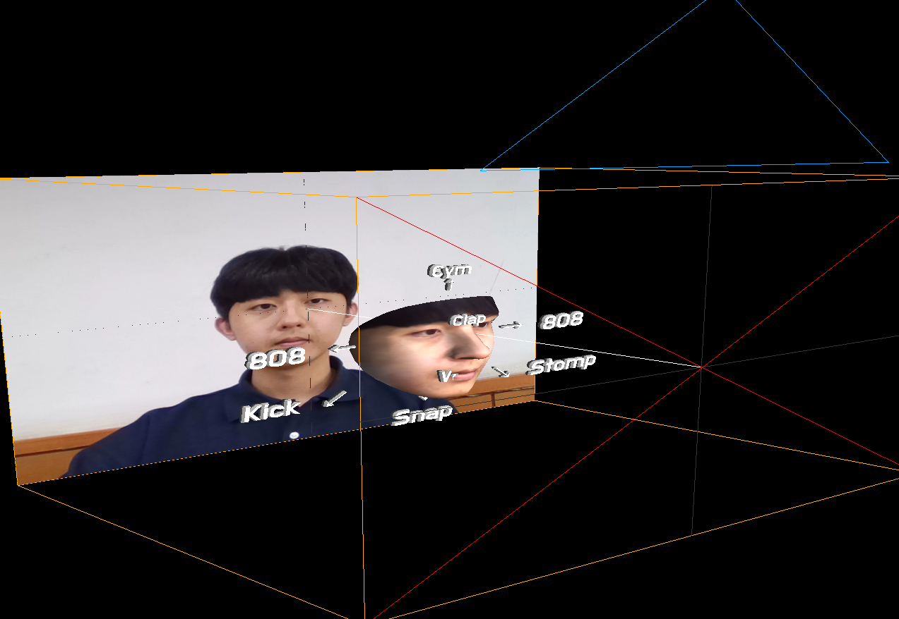

# LoopStation-with-FaceDrum

## 22학년 1학기 증강현실 팀프로젝트

---

>[TikTok 필터](https://www.tiktok.com/search/video?q=face%20drum&t=1656753628669)에서 아이디어를 착안하여 얼굴 움직임을 활용한 드럼 사운드 플레이와 손동작으로 루프스테이션 기능을 제어하도록 구현

### 개발 스택

- [three.js](https://threejs.org/)
- [MediaPipe](https://google.github.io/mediapipe/)

### 구현 내용

- Face Mesh에 붙어 움직이는 AR 가이드라인 제공
- Face Mesh의 Orientation에 따라 다양한 사운드 재생
- Hand 모델을 활용하여 Loop Station 제어

---

### 예시 이미지

- World View

- Play View

